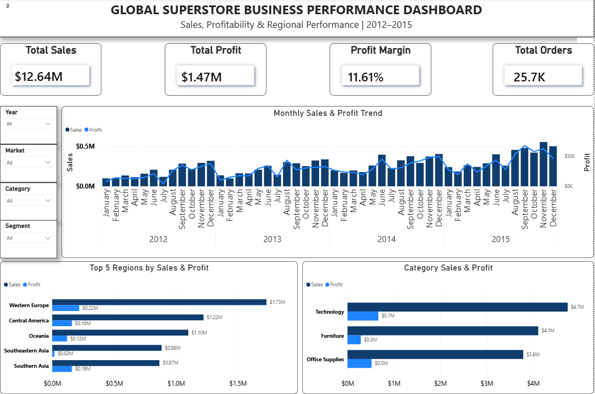
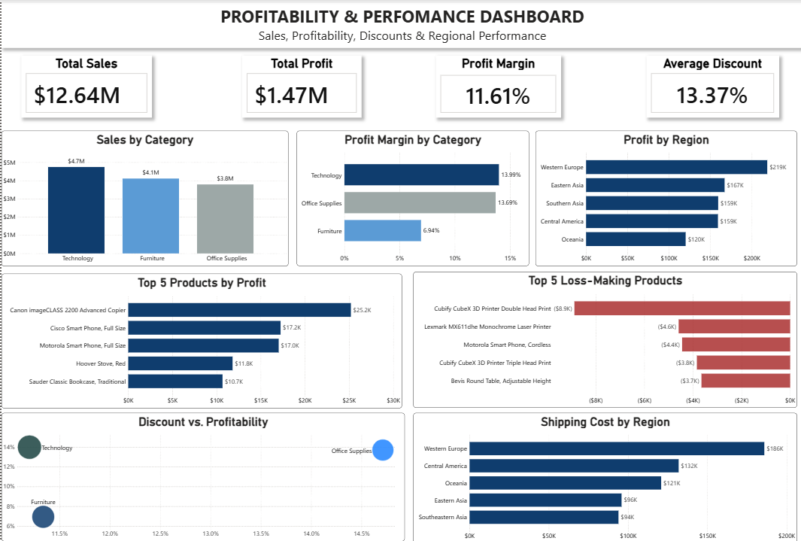

# Global Superstore Sales Analysis

##  Project Overview

This project analyzes the **Global Superstore** dataset to evaluate sales performance, profitability, customer activity, product performance, and regional trends.

The project combines **PostgreSQL** for data analysis and business-focused SQL queries with **Power BI** for interactive dashboard development. The analysis concludes with a professional business performance report containing key findings and recommendations.

---

##  Business Objective

The main objective of this project is to transform transactional sales data into actionable business insights that can support better business decision-making.

The analysis focuses on:

* Overall sales and profit performance
* Category and product profitability
* Sales and profit trends over time
* Regional and market performance
* Customer and segment performance
* Opportunities to improve profitability

---

##  Dataset

The project uses the **Global Superstore** dataset sourced from Kaggle.

The dataset contains approximately **51,290 records** and **24 columns**, covering transactions from **2012 to 2015**.

The dataset includes transactional, customer, product, regional, sales, quantity, discount, and profit information.

The data was prepared and cleaned in **Microsoft Excel** before being loaded into PostgreSQL for analysis.

---

##  Tools & Technologies

| Tool                | Purpose                                          |
| ------------------- | ------------------------------------------------ |
| **Microsoft Excel** | Data preparation and cleaning                    |
| **PostgreSQL**      | Data storage, SQL analysis, and analytical views |
| **Power BI**        | Interactive dashboards and data visualization    |
| **Microsoft Word**  | Business performance report                      |
| **GitHub**          | Version control and portfolio presentation       |

---

##  Project Workflow

The project follows an end-to-end analytics workflow:

**Data Preparation**
↓
**PostgreSQL Table Creation**
↓
**SQL Views & Analysis**
↓
**Power BI Dashboards**
↓
**Business Performance Report**

---

##  Dashboard Preview

### Executive Business Performance Dashboard



### Profitability & Performance Dashboard



---

##  Key Performance Indicators

The analysis produced the following overall business metrics:

| KPI                  |      Result |
| -------------------- | ----------: |
| **Total Sales**      | **$12.64M** |
| **Total Profit**     |  **$1.47M** |
| **Profit Margin**    |  **11.61%** |
| **Total Orders**     |  **25,728** |
| **Products Sold**    | **178,312** |
| **Unique Customers** |  **17,415** |

---

##  Power BI Dashboards

The Power BI solution consists of two main dashboards.

### 1. Executive Business Performance Dashboard

Provides a high-level view of:

* Total sales
* Total profit
* Profit margin
* Orders
* Customer activity
* Regional performance
* Sales and profit trends

### 2. Profitability & Performance Dashboard

Provides deeper analysis of:

* Category performance
* Product profitability
* Profit margins
* Sales and profit trends
* Regional performance
* Profitability-related metrics

Interactive filters allow users to explore performance across different years, categories, markets, and customer segments.

---

##  Key Business Insights

The analysis identified several important areas of business performance:

* The business generated approximately **$12.64M in sales** and **$1.47M in profit** across the analyzed period.
* The overall **profit margin was 11.61%**, providing a baseline for evaluating profitability across products, categories, and regions.
* Sales and profitability vary across categories, products, customers, and regions, highlighting areas of both strong and weak performance.
* Product-level analysis helps identify products that make strong contributions to profitability as well as products requiring closer performance review.
* Regional analysis highlights differences in sales and profit performance across markets.
* Monthly analysis provides visibility into changes in sales and profitability over time.

The Power BI dashboards provide an interactive way to investigate these patterns and identify areas requiring further business attention.

---

##  Business Recommendations

Based on the analysis, the business should consider:

1. **Prioritizing profitable products and categories**
   Focus resources on products and categories that consistently contribute strong profit.

2. **Investigating low-profit performance**
   Review products, categories, and regions with weak profitability to identify potential issues related to pricing, discounts, or costs.

3. **Monitoring discount and profitability relationships**
   Evaluate whether higher discounts generate sufficient additional sales to justify their impact on profit margins.

4. **Strengthening regional performance management**
   Compare regional sales and profitability to identify high-performing markets and areas requiring improvement.

5. **Using performance monitoring dashboards**
   Continue monitoring KPIs and business trends through interactive dashboards to support data-driven decision-making.

---

##  Business Performance Report

A detailed **Global Superstore Business Performance Report** accompanies the analysis.

The report provides a deeper discussion of the business findings, dashboard visualizations, insights, and recommendations.

 **[View the Business Performance Report](04_reports/Global_Superstore_Business_Performance_Report.pdf)**

---

##  Repository Structure

```text
superstore-sales-analysis/
│
├── 01_create_table/
│   └── 01_create_table.sql
│
├── 02_SQL/
│   ├── 01_Views/
│   │   └── 02_create_views.sql
│   │
│   └── 02_Analysis/
│       ├── 03_executive_summary_analysis.sql
│       ├── 04_monthly_summary_analysis.sql
│       ├── 05_category_summary_analysis.sql
│       ├── 06_product_summary_analysis.sql
│       ├── 07_regional_summary_analysis.sql
│       └── 08_customer_summary_analysis.sql
│
├── 03_powerbi/
│   └── Global_Superstore_Dashboard.pbix
│
├── 04_reports/
│   └── Global_Superstore_Business_Performance_Report.pdf
│
├── 05_screenshots/
│   ├── Executive_Dashboard.png
│   └── Profitability_Performance_Dashboard.png
│
├── README.md
└── .gitignore
```

##  Project Outcome

This project demonstrates an end-to-end data analytics workflow, from preparing and analyzing transactional data to communicating business insights through interactive dashboards and a professional business report.

### Core Skills Demonstrated

* Data preparation and cleaning
* SQL
* PostgreSQL
* Business analysis
* Data visualization
* Power BI
* KPI development
* Dashboard design
* Business reporting
* Data-driven recommendations
* GitHub project organization


